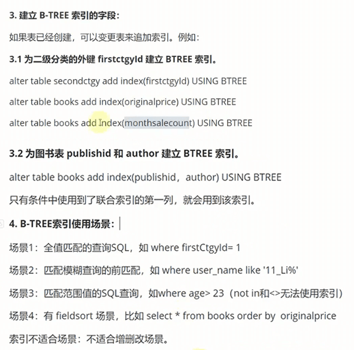

# koa mysql


## node搭配ts设置路径别名
参考地址 https://www.cnblogs.com/gogechang/p/17894865.html
```
# 安装第三方依赖
npm i module-alias @types/module-alias;
```
1、在tsconfig.json中增加baseUrl和paths配置
```
{
  "compilerOptions": {
    "baseUrl": "./",
    "paths": {
      "@/*": ["./src/*"],
      "@modules/*": ["./src/modules/*"]
    }
  }
}
```
2、在package.json中增加_moduleAliases属性配置
```
{
  "scripts": {},
  "_moduleAliases": {
    "@": "./src",
    "@modules": "./src/modules"
  }
}
```
3、在你的项目入口文件中，此项目的app.ts文件中，在第一行加入这段代码
```
import 'module-alias/register'
或者下面这种
require('module-alias/register')
```

## 安装mysql
- 1.下载下来安装完成后
- 2.配置环境变量，在安装完的目录中找到bin文件夹，复制地址配置到变量中
```
D:\extract\MySQL\MySQL_Server_8.0\bin // 示例
```
- 3.配置my.ini文件，配置如下
```
[mysql]
#设置mysql客户端默认字符集, utf8mb4是utf8的超集并完全兼容utf8, 能够用4个字节存储更多的字符，如表情符等
default-character-set=UTF8MB4

[mysqld]
#设置mysql的安装目录
basedir=D:\extract\MySQL\MySQL_Server_8.0
#设置mysql数据库的数据存储目录，必须是data，或者是\\xxx\\data
datadir=D:\extract\MySQL\MySQL_Server_8.0\data
#服务端使用的字符集默认为8比特编码的latin1字符集
character-set-server=UTF8MB4
#设置端口
port = 3306
#允许最大连接数，默认200
max_connections=400
#创建新表时将使用的默认存储引擎
default-storage-engine=INNODB

[client]
port=3306
default-character-set=UTF8MB4

```
- 4.初始化data目录, 保存一些创建服务和启动服务需要的初始数据
```
mysqld --initialize-insecure
```
- 5.以管理员身份安装mysql服务
```
// mysqld --install 当前mysql服务名 --defaults-file="mysql安装目标中my.ini的目录地址"
mysqld --install mysql2024 --defaults-file="D:\extract\MySQL\MySQL_Server_8.0\my.ini"

// 启动mysql2024服务的命令: net start 服务名
net start mysql2024
// 停止mysql2024服务的命令: net stop 服务名
net stop mysql2024

// 开启服务后，登录mysql命令
# -h是mysql的服务器地址，本地就是localhost或者直接省略
# -P是mysql的端口号默认是3306，没改动的话可省略
# -u后面是用户名 root为mysql安装后默认的用户名
# -p 指输入密码，安装后root用户默认没密码，所以提示输密码时，直接回车就好，如果你安装时设置了密码，则输入你的密码即可，如此时我配置的是1234
mysql -h localhost -P 3306 -u root -p 1234
mysql -uroot -p1234
mysql -h192.168.0.106 -P3306 -uroot -p1234

// mysql创建一个新用户 admin 密码 1234
# 早期版本mysql旧的写法 create user 'admin' identified by '1234'; // 创建一个用户admin  identified:确定密码为1234
# 后期版本mysql新的写法 create user 'admin' identified with mysql_native_password by '1234'; // 创建一个用户admin  identified:确定密码为1234

// 退出mysql命令行 quit;

// 在root用户下为新用户admin分配权限, 不然admin无权限创建修改数据库
# 把所有增删改查的数据库权限，赋予给admin用户，@'%'指密码可以是任意的
grant all privileges ON *.* TO admin@'%';

// 切换到admin用户
mysql -uadmin -p1234

```
- 6.mysql之 建表、增删改查表、增删改字段
    - 关于mysql的操作命令说要大写，是为了区分变量和数据库语句。

  `创建数据库`
  ```
  // 创建数据库
  # 如果不存在test数据库，则创建
  # character 指定数据库字符集为utf8mb4 避免在数据库中存的数据出现乱码或有些字符不支持的情况
  # collate 指定字符集的默认校对规则
  create database if not exists 数据库名 character set utf8mb4 collate utf8mb4_general_ci;

  // 查看数据库命令 show databases;
  // 选择数据库命令 use 数据库名;
  // 删除数据库命令 drop database if exists 数据库名; 
  drop database if exists test2; // 假如存在test2数据库就删除

  //【数据库备份】使用mysqldump导出数据：不能切到mysql控制台再使用以下命令，打开cmd就可以直接跑了
  mysqldump -u用户名 -p密码 --set-gtid-purged=OFF 旧数据库名 > /导出地址/xxx.sql

  mysqldump -uadmin -p1234 --set-gtid-purged=OFF test > D:\test.sql

  mysqldump -u admin -p1234 test > d:\test2.sql 
  // linux上
  mysqldump -u admin -p1234 test > /tmp/tset_db.sql


  仅是做普通的本机备份恢复时,可以添加
  --set-gtid-purged=OFF
  作用是在备份时候不出现GTID信息

  // 导入数据到新库：
  mysql -u用户名 -p密码 数据库名 < /数据库文件地址/xxx.sql
  mysql -uadmin -p1234 new_db < d:/test.sql


  // 创建数据库表
      // 字符类型
      char(固定长度) 1-255字节   如电话号码 char(11)
      varchar(可变长) 1-255字节  如人的姓名 用varchar(30)
      text(大文本) 65535字节
      // 整数类型
      tinyint(1个字节) 如人的年龄就够用，最大值127
      smallint(2个字节) 最大值 32767
      mediumint(3个字节) 最大值 8388607
      int(4个字节) 最大值 2147483647
      bigint(8个字节) 最大值9223372036854775807
      // 浮动类型
      float(4个字节)   double(8个字节)
      // 日期/时间类型
      date(3个字节)     年月日 1959/07/25
      datetime(8个字节) 年月日时分秒  1959/07/25 10:26:09


  create table 表名(
      userid字段 int not null auto_increment, // userid为自增字段
      username字段 varchar(30) not null,
      psw字段 varchar(30) not null,
      address字段 varchar(50) default '没有填写地址',
      valid字段 tinyint default 1,
      birth字段 datetime null,
      primary key(字段userid) // 主键用userid字段，主键是一个可以唯一表示一条记录的字段
  );

  create table userinfo(
      userid int not null auto_increment,
      username varchar(30) not null,
      psw varchar(30) not null,
      address varchar(50) default '没有填写地址',
      valid tinyint default 1,
      birth datetime null,
      primary key(userid)
  );


  // 以下方式，直接声明在哪个数据库下，建表 
  create table 数据库名.表名(
    username字段 varchar(30) not null,
  )
  create table `数据库名`.`表名`(
    username字段 varchar(30) not null,
  )

  // 展示出当前的创建命令，以及外键信息
  show create table 表名;
  show create table 数据库名.表名;
  show create table books.thirdctgy;
  ----------------------------------------------------------------------------------------------------------+
  | Table     | Create Table
  +-----------+---------------------------------------------------------------------------------------------+
  | thirdctgy | CREATE TABLE `thirdctgy` (
    `thirdctgyid` int NOT NULL AUTO_INCREMENT,
    `thirdctgyname` varchar(20) COLLATE utf8mb4_general_ci NOT NULL,
    `secctgyid` int DEFAULT NULL,
    PRIMARY KEY (`thirdctgyid`),
    KEY `fk_secctgyid` (`secctgyid`),
    CONSTRAINT `fk_secctgyid` FOREIGN KEY (`secctgyid`) REFERENCES `secondctgy` (`secondctgyid`)
  ) ENGINE=InnoDB AUTO_INCREMENT=45 DEFAULT CHARSET=utf8mb4 COLLATE=utf8mb4_general_ci |
  +-----------+------------------------------------------------------------------------------------------------


  // 查询出表的列信息，每列字段的数据类型，及有哪些列字段
  方法一：desc 表名; 
    desc userinfo;
  方法二：show columns from 表名; 
    show columns from userinfo;

  // 修改表名
  alter table userinfo rename myuserinfo; // 修改表userinfo的表名为myuserinfo

  // 修改表字段
  alter table 表名 change 旧字段名 新字段名 新数据类型
  alter table userinfo change psw password varchar(20);

  // 删除表字段
  alter table 表名 drop 字段名

  // 新增表字段
  alter table 表名 add column 字段 字段类型 default 默认值;
  alter table userinfo add age tinyint default 30;
  alter table userinfo add column age tinyint default 30;

  // 删除数据表
  drop table if exists 表名
  ```

- 7.mysql表数据的增删改查
  ```
  // 增加一条mysql表数据
  insert into userinfo values(1,'zhangsan','1234','广州',1,'1999/09/09 09:09:09');
  insert into userinfo(username,password,birth) values('李四','1234','2001/01/01 01:01:01');

  // 删除一条mysql表数据
  delete from 表名 where 条件;
  delete from userinfo where username='王二' and address='广州';
  delete from userinfo where username='王二' and birth is null; 

  # 此种方式 limit 无法使用 limit 1, 2 或 limit 2 offset 1 这种模式
  DELETE FROM books.historykeyword ORDER BY clickcount DESC LIMIT 1

  // 子查询+临时表 实现复杂 删除
  DELETE FROM books.historykeyword 
  WHERE historykeywordid IN (
      SELECT historykeywordid
      FROM (
          SELECT historykeywordid 
          FROM books.historykeyword 
          ORDER BY clickcount DESC 
          LIMIT 0, 1
      ) AS temp
  )


  // 更新mysql表里面的数据
  update 表名 set 字段名1=值, 字段名2=值, 字段名3=值 ... [where一个可选的子句，用于指定更新的行。如果省略 WHERE 子句，将更新表中的所有行];
  update userinfo set username='王二', address='湖南长沙' where userid=3;
  update userinfo set username='王二', address='湖南长沙' where userid=3 and password=1234;

  // 查询mysql表数据
  # 查询表所有行数据
  select * from 表名;
  select * from userinfo; 

  # 投影查询，就是只查询出部分字段数据
  select 字段名1, 字段名2 from 表名; 
  select userid, address from userinfo; 

  # 查询别名设置
  select 字段名 as 别名, 字段名2 as 别名2 from 表名; 
  select username as 用户名, address as 地址, ... from userinfo; 
  或者直接省略as 
  select 字段名 别名, 字段名2 别名2, ... from 表名;
  select username 用户名, address 地址 from userinfo;

  # limit查询
  limit查询mysql中的一个特殊关键字，用于指定查询结果从哪条记录开始显示，一共显示多少条，有三种使用方式：
  1. limit从哪条(用下标的方式，第一数据为0)记录开始查，查询几条数据
  select * from userinfo limit 1,3; // 表示从第二条数据开始查（包括第二条），查3条

  2. limit后只写一个记录数，会从第一条记录开始查询
  select * from userinfo limit 3; // 表示从第一条开始查（包括第一条），查询3条

  3. limit后先写记录数，offset后面写起始位置从哪条开始查，和第一种类似
  select * from userinfo limit 3 offset 1; // 表示查3条，从第二条数据开始查（包括第二条），查询结果和第一种方式相同

  # 条件查询
  and（且）查询 
  select * from 表名 where 字段1=值 and 字段2=值;
  select * from userinfo where username='李四' and password=1234;

  or（或）查询  
  select * from 表名 where 字段1=值 or 字段2=值;
  select * from userinfo where username='李四' or password=1234;

  between（区间）查询  
  select * from 表名 where 字段名 between 开始区间值（包含自身） and 结束区间值（包含自身）;
  select * from userinfo where age between 18 and 35; // 结果18-35岁的都会查出来

  in查询
  select * from 表名 where 字段名 in(值1,值2,...);
  select * from userinfo where age in(18,21,26); // 结果：只要是18、21、26岁的都会查出来

  is null 空值查询
  select * from 表名 where 字段名 is null;
  select * from userinfo where birth is null; // 只要生日字段birth为NULL的都会查出来

  like模糊查询 %表示一个到多个任意字符,但无法匹配null和空格 _下划线表示一个字符 __两个_表示两个字符 以此类推
  # mysql4.5以上一个_可以代表一个字母也可代表一个汉字，统一按字符的个数来算，如varchar(20)可以写20个英文字母也可写20个汉字
  select * from 表名 where 字段名 like 条件;
  # 条件（字母不区分大小写，如：like 'M%'和like 'm%'结果是一样的）;
  select * from userinfo where username like '小%';   //查询名字 以小字开头的所有人
  select * from userinfo where username like ' 小%';  //查询名字 以空格加小字开头的所有人
  select * from userinfo where username like ' 小% '; //查询名字 以空格加小字开头，且结尾为空格的所有人
  select * from userinfo where username like '%菲%';  //查询名字 中间包含菲字的所有人
  select * from userinfo where username like '_菲%';  //查询名字 第二个字是菲字的的所有人
  select * from userinfo where username like '_菲_';  //查询名字 为三个字且中间为菲字的所有人
  select * from userinfo where username like '__菲';  //查询名字 为三个字且最后一字为菲字的所有人
  # 加binary 实现模糊查询区分大小写
  select * from 表名 where 字段名 like binary 条件;
  select * from userinfo where username like binary 'L%'; //查询名字 以大写L字母开头的所有人

  # 聚合查询
  ## count计算
  select count(*) from userinfo;
  select count(*) as 用户总数 from userinfo;

  select count(userid) from userinfo;
  +---------------+
  | count(userid) |
  +---------------+
  |            11 |
  +---------------+
  select count(birth) as 有生日数据的总数 from userinfo;
  // birth列值为null的不会计算进来
  +--------------------------+
  | 有生日数据的总数         |
  +--------------------------+
  |                        7 |
  +--------------------------+
  ## max最大值
  select max(userid) as 最大用户id from userinfo;
  +----------------+
  | 最大用户id     |
  +----------------+
  |             12 |
  +----------------+
  ## min最小值
  select min(userid) as 最小用户id from userinfo;
  select min(userid) as 最小用户id, max(userid) as 最大用户id from userinfo;
  +----------------+----------------+
  | 最小用户id     | 最大用户id     |
  +----------------+----------------+
  |              1 |             12 |
  +----------------+----------------+
  ## avg平均值
  select avg(userid) as 平均值, max(userid) as 最大用户id from userinfo;
  +-----------+----------------+
  | 平均值    | 最大用户id     |
  +-----------+----------------+
  |    6.0909 |             12 |
  +-----------+----------------+
  # 分组聚合查询
  // 给address分组了，除了address外，其它字段就不能单独展示了，只能用计数的方式展示
  select address as 地址, count(valid) as 总人数 from userinfo where valid=1 group by address;
  +-----------------------------+-----------+
  | 地址                        | 总人数    |
  +-----------------------------+-----------+
  | 广州                        |         3 |
  | 湖北武汉                    |         1 |
  | 江西南昌市青山湖区          |         2 |
  | 没有填写地址                |         1 |
  | 东莞                        |         1 |
  | 上海                        |         1 |
  | 重庆                        |         1 |
  +-----------------------------+-----------+
  select count(birth) as 有生日人数, address as 地址, count(valid) as 总人数 from userinfo where password=1234 or username='小七' group by address;
  +-----------------+--------------------+-----------+
  | 有生日人数      | 地址               | 总人数    |
  +-----------------+--------------------+-----------+
  |               2 | 广州               |         3 |
  |               1 | 湖北武汉           |         1 |
  |               0 | 没有填写地址       |         1 |
  |               0 | 东莞               |         1 |
  |               1 | 上海               |         1 |
  |               1 | 重庆               |         1 |
  +-----------------+--------------------+-----------+
  // 根据多列数据分组，此处根据username和address分组，统计相同名字且地址一样的有多少人，这里面有生日数据的有多少人
  select count(birth) as 有生日人数,username,  address as 地址, count(valid) as 总人数 from userinfo where password=1234 or username='小七' group by address, username;
  +-----------------+----------+--------------------+-----------+
  | 有生日人数      | username | 地址               | 总人数    |
  +-----------------+----------+--------------------+-----------+
  |               1 | zhangsan | 广州               |         1 |
  |               1 | 李四     | 湖北武汉           |         1 |
  |               1 | 李one    | 广州               |         1 |
  |               0 | 王二     | 没有填写地址       |         1 |
  |               0 | 小七     | 东莞               |         1 |
  |               1 | 丽影     | 上海               |         1 |
  |               1 | 小晴     | 重庆               |         2 |
  |               0 | 莫菲     | 广州               |         1 |
  +-----------------+----------+--------------------+-----------+
  ```
- 8. mysql排序 order by xxx asc/desc
  升序asc 降序desc
  ```
  select * from 表名 order by 字段1 升或降, 字段2 升或降;
  # 字段排序优先级，从左到右
  select * from books.userinfo order by userid desc, password desc;
  ```

## 安装Navicat工具操作mysql数据库
链接：https://pan.baidu.com/s/1YK-triv80E7O4Whvu58NnA?pwd=y45k 
提取码：y45k


## 在TS中使用esModule的方法引用nodejs模块
 - 安装 npm i ts-node -S 并用ts-node执行代码
 ```
 "scripts": {
    "dev": "set NODE_ENV=dev&& nodemon --watch src/ -e ts --exec ts-node ./src/app.ts",
    "prod": "set NODE_ENV=prod&& nodemon --watch src/ -e ts --exec ts-node ./src/app.ts"
  },
 ```
 - 在tsconfig.json中配置相关几项
 ```
   "compilerOptions": {
    "target": "ES2020",
    "module": "CommonJS",
    "moduleResolution": "Node",
    "esModuleInterop": true, // 允许依赖库中出export=这种兼容规范导出的格式，ts可以用import from导入
  }
 ```

## 安装Koa等依赖
```
npm install koa -S
npm install @types/koa -S
// 支持post请求依赖
npm install koa-body -S
// 支持响应数据对象转json格式的依赖
npm i koa-json -S
npm i @types/koa-json -S
// 路由器依赖
npm i koa-router -S
npm i @types/koa-router -S
// token依赖
npm i jsonwebtoken -S
npm i @types/jsonwebtoken -S
// javascript实用工具库
npm i @types/lodash -S
// 日志依赖
npm i log4js -S
// 支持访问mysql数据库依赖
npm i mysql -S
npm i @types/mysql -S
// 装饰器元数据
npm i reflect-metadata -S
// ORM映射工具依赖
npm i sequelize -S
npm i sequelize-typescript -S
// 自动检测文件变化后自动重启依赖
npm i nodemon -S
// typescript + ts-node依赖
npm i typescript -S
npm i ts-node -S
// 使用koa封装的jwt中间件依赖
npm i koa-jwt

```
复制粘贴到控制台，共19个依赖
```
npm install koa -S
npm install @types/koa -S
npm install koa-body -S
npm i koa-json -S
npm i @types/koa-json -S
npm i koa-router -S
npm i @types/koa-router -S
npm i jsonwebtoken -S
npm i @types/jsonwebtoken -S
npm i @types/lodash -S
npm i log4js -S
npm i mysql -S
npm i @types/mysql -S
npm i reflect-metadata -S
npm i mysql2 -S
npm i sequelize -S
npm i sequelize-typescript -S
npm i nodemon -S
npm i typescript -S
npm i ts-node -S
npm i koa-jwt
npm i cross-env
npm i colors-console

# 用mariadb替代mysql
npm install mariadb
```

## 使用cross-env兼容window和linux设置环境变量差异
window上用set linux上则用export 所以要写几套，不能统一，此时就可以上cross-env了
```json
  "scripts": {
    "exec": "pm2 start --interpreter ./node_modules/.bin/ts-node ./src/app.ts --name books -i 2 --watch",
    # 看看 每次相同的命令要配两次，很麻烦对不对
    "dev_win": "set NODE_ENV=dev&& nodemon --watch src/ -e ts --exec ts-node ./src/app.ts",
    "dev_linux": "export NODE_ENV=dev&& nodemon --watch src/ -e ts --exec ts-node ./src/app.ts",
    "pm2dev_win": "set NODE_ENV=dev&& npm run exec",
    "pm2dev_linux": "export NODE_ENV=dev&& npm run exec",
    # 以下是 cross-env 简化版, 连后面的&& 都省略了，记住别加，加了变量值就加上后面的 && 成 dev&& 了
    "dev": "cross-env NODE_ENV=dev nodemon --watch src/ -e ts --exec ts-node ./src/app.ts",
    "pm2dev": "cross-env NODE_ENV=dev npm run exec",
  },
```

## 使用 chalk 或 colors-console 实现console输出不同颜色
```
npm i colors-console
```
默认情况下，使用以下方案直接打印，也可实现，在浏览器也可直接运行
```js
console.log('\x1B[31m%s\x1B[0m', '这是红色') // 打印出红色字
console.log('\x1B[36m%s\x1B[0m', '这是青色') // 打印出青色字

// 颜色参考
{
'bright'    : '\x1B[1m', // 亮色
'grey'      : '\x1B[2m', // 灰色
'italic'    : '\x1B[3m', // 斜体
'underline' : '\x1B[4m', // 下划线
'reverse'   : '\x1B[7m', // 反向
'hidden'    : '\x1B[8m', // 隐藏
'black'     : '\x1B[30m', // 黑色
'red'       : '\x1B[31m', // 红色
'green'     : '\x1B[32m', // 绿色
'yellow'    : '\x1B[33m', // 黄色
'blue'      : '\x1B[34m', // 蓝色
'magenta'   : '\x1B[35m', // 品红
'cyan'      : '\x1B[36m', // 青色
'white'     : '\x1B[37m', // 白色
'blackBG'   : '\x1B[40m', // 背景色为黑色
'redBG'     : '\x1B[41m', // 背景色为红色
'greenBG'   : '\x1B[42m', // 背景色为绿色
'yellowBG'  : '\x1B[43m', // 背景色为黄色
'blueBG'    : '\x1B[44m', // 背景色为蓝色
'magentaBG' : '\x1B[45m', // 背景色为品红
'cyanBG'    : '\x1B[46m', // 背景色为青色
'whiteBG'   : '\x1B[47m' // 背景色为白色
}
```
但是以上方案太过麻烦且很难记住色值，以下是colors-console简化版

`颜色参数为字符串时`
```js
const colors = require('colors-console')

console.log('颜色是：' + colors('red', '红色'))
console.log('颜色是：', colors('cyan', '青色'))

```

`颜色参数为数组时`
```js
console.log(colors(['red','greenBG','underline'], '这是红色、绿色背景、下划线'))

```

`使用 chalk 来实现log样式化`

https://github.com/chalk/chalk

```
npm install chalk
```
使用 
```
import chalk from 'chalk';

.log(chalk.blue('Hello world!'));

console.log(chalk.blue('Hello') + ' World' + chalk.red('!'));

console.log(chalk.blue('Hello', 'World!', 'Foo', 'bar', 'biz', 'baz'));

console.log(chalk.red('Hello', chalk.underline.bgBlue('world') + '!'));
```

## 配置启动脚本【热部署】
```
// 当我们用nodemon启动项目后 nodemon会监听src/下的ts文件有更改，就调用ts-node命令来执行 ./src/app.ts
"scripts": {
    "dev": "nodemon --watch src/ -e ts --exec ts-node ./src/app.ts"
}
```

## 常规app.ts文件编码【先用常规写法，后面再逐步升级】

### 实现一级路由 src/app.ts
```
import koa from 'koa'
import body from 'koa-body'
import json from 'koa-json'
import Router from 'koa-router'

const app = new koa()
const router = new Router()
router.prefix('/dang') // 为所有的路由访问添加路由前缀/dang 来作为一级路由

router.get('/test', async (ctx: koa.Context, next: koa.Next) => {
  // ctx:为请求结果的上下文ContextDelegatedResponse body为请求反回的数据
  ctx.body = '第一个测试页面'
  // ctx.app为上面的全局对象 const app = new koa()，被封装在每个请求的上下文对象中
  // ctx.app.context 为全局的上下文
})
router.use(json())
router.use(body())

// 加载路由到全局路由上
app.use(router.routes())
app.listen(3002)
console.log('server running on prot 3002')

// 启动访问 http://localhost:3002/dang/test
```
### 实现二级路由 src/router/User.ts
- 第一步 编写二级路由User.ts
```
import { Context } from 'koa'
import Router from 'koa-router'
const router = new Router()

router.prefix('/usermodule')
router.get('/findUserinfo/:username', async (ctx: Context) => {
  const { username } = ctx.params
  ctx.body = `您好：${username}`
})

export default router
```

- 第二步 在app.ts中引入，把user路由加到一级路由app.ts中
```
import koa from 'koa'
import body from 'koa-body'
import json from 'koa-json'
import Router from 'koa-router'
import userRouter from './router/user'

const app = new koa()
const router = new Router()
router.prefix('/dang')

router.get('/test', async (ctx: koa.Context, next: koa.Next) => {
  ctx.body = '第一个测试页面'
})
router.use(json())
router.use(body())

// 把userRouter加到一级路由中
router.use(userRouter.routes(), userRouter.allowedMethods())

app.use(router.routes())
app.listen(3002)
console.log('server running on prot 3002')

// 启动访问  http://localhost:3002/dang/usermodule/findUserinfo/张三

```
### 实现 post 请求
```
// User.ts中
router.post('/addUser', async (ctx: Context) => {
  const user: Userinfo = ctx.request.body
  ctx.body = `您好：${user.username}, 年龄：${user.age}`
})
```
### 避免新增路由时，总要手动在app.ts中手动添加，手写自动路由加载
- 手动添加示例：router.use(userRouter.routes(), userRouter.allowedMethods())
- 已有requireDirectory路由自动加载工具，手写自动路由加载，是因为它对TS支持不友好

- 新建 自动加载工具文件 src\common\AllRouterLoader.ts
```
import path from 'path'
import fs from 'fs'
import Router from 'koa-router'
import Koa from 'koa'
import body from 'koa-body'
import json from 'koa-json'

class AllRouterLoader {
  app!: Koa
  // 设置成单例模式，用于保证对象的唯一
  static allRouterLoader: AllRouterLoader = new AllRouterLoader()
  // 初始化方法
  init(app: Koa) {
    // console.log(this.getAbsoluteFilePaths())
    this.app = app
    const rootRouter = this.loadAllRouterWrapper()

    // 4.加载路由到全局路由上
    this.app.use(rootRouter.routes())

    // 5.监听方法
    this.listen()
  }
  // 1.加载路由文件夹src/router下的，所有路由文件名数组
  getFiles(dir: string) {
    return fs.readdirSync(dir)
  }
  // 2.加载所有路由文件绝对路径数组
  getAbsoluteFilePaths() {
    // 获取当前执行环境地址，拼接路由文件夹地址
    // 'D:\study-project\viteProject\server_koamysq\src\router'
    const dir: string = path.join(process.cwd(), '/src/router')

    // ['User.ts', 'Books.ts']
    const allFiles: string[] = this.getFiles(dir)
    const allFullFilePaths: string[] = []
    for (let file of allFiles) {
      const fullFilePath = dir + '\\' + file
      allFullFilePaths.push(fullFilePath)
    }
    return allFullFilePaths
  }
  // 3.加载所有一级路由到二级路由中
  loadAllRouterWrapper() {
    // 3.0 获取一级路由
    const rootRouter = this.rootRouter()
    // 3.1 调用获取绝对路径数组方法
    const allFullFilePaths = this.getAbsoluteFilePaths()
    // 3.2 调用加载所有二级路由到一级路由方法
    this.loadAllRouter(allFullFilePaths, rootRouter)
    return rootRouter
  }
  // 3.0 获取一级路由
  rootRouter() {
    const rootRouter = new Router()
    rootRouter.prefix('/dang')
    this.app.use(json())
    this.app.use(body())
    return rootRouter
  }
  // 自定义守卫
  isRouter(data: any): data is Router {
    return data instanceof Router
  }
  loadAllRouter(allFullFilePaths: string[], rootRouter: Router) {
    for (let fullFilePath of allFullFilePaths) {
      const module = require(fullFilePath)
      if (this.isRouter(module)) {
        rootRouter.use(module.routes(), module.allowedMethods())
      }
    }
  }
  listen() {
    this.app.listen(3002)
    console.log('在3002端口监听...')
  }
}

export default AllRouterLoader.allRouterLoader

```
- 修改src/router/User.ts中的导出方式，改用node的方式module.exports=
```
// export default router

// src\common\AllRouterLoader.ts 中使用require导入所有二级路由文件，所以改用node方法导出
module.exports = router
```
- 在app.ts入口文件中导入引用, 并删除其他多余代码，只保留如下
```
import koa from 'koa'
import allRouterLoader from './common/AllRouterLoader'

const app = new koa()
allRouterLoader.init(app)

```

### 搭建Aop全局通用异常
通用异常处理中间件src\common\GlobalException.ts

```
// 在src\common\AllRouterLoader.ts中引入使用，挂载到全局app上

init(app: Koa) {
  // 因为koa中间件洋葱模型原因
  // 加载通用异常中间件到全局，且必须在挂载路由之前
  this.app.use(globalException)
  // 加载路由到全局路由上的操作，需在加载通用异常中间件 之后
  this.app.use(rootRouter.routes())

}

```
- koa中间件洋葱模型
```
import koa from 'koa'
const app = new koa()

const middleware1 = async (ctx: Context, next: koa.Next) => {
  console.log('第一个中间件开始')
  await next()
  console.log('第一个中间件结束')
}
const middleware2 = async (ctx: Context, next: koa.Next) => {
  console.log('第二个中间件开始')
  await next()
  console.log('第二个中间件结束')
}
const middleware3 = async (ctx: Context, next: koa.Next) => {
  console.log('第三个中间件开始')
  await next()
  console.log('第三个中间件结束')
}
app.use(middleware1)
app.use(middleware2)
app.use(middleware3)

# 执行的结果顺序: 

第一个中间件开始
第二个中间件开始
第三个中间件开始
第三个中间件结束
第二个中间件结束
第一个中间件结束
```
### 响应成功和失败的精简封装
```
enum Code {
  SUCCESS = 200,
  SERVERERROR = 500,
}

export class ResResult {
  static success(data: any = undefined, msg: any = '') {
    const code: Code = Code.SUCCESS
    return { data, msg, code }
  }
  static fail(msg: any = '') {
    const code: Code = Code.SERVERERROR
    return { undefined, msg, code }
  }
}

export let { success, fail } = ResResult

```
在app.ts中用中间件的方式挂载
```
import koa, { Context } from 'koa'
import { success, fail } from './common/ResResult'
const app = new koa()
// 把请求错误和成功的统一处理，用中间件的方式挂载到context上
app.use(async (ctx: Context, next: koa.Next) => {
  ctx.resSuccess = success
  ctx.resFail = fail
  await next()
})
```
### 日志封装-运用TS封装log4js
src\common\LogUtil.ts
### 数据库配置封装-TS实现mysql配置【泛型综合+重载】
src\conf\DbConfig.ts
### Dao封装-mysql连接和异步查询方法+Dao实现
src\dao\
### ORM框架-对象关系映射框架——Sequelize的3种mysql数据库操作方案和5种查询
- ORM就是为了避免直接编写sql语名带来的繁琐，而把关系型数据表数据直接映射为js对象进行查询，同时也能把js对象转换为关系型数据表的数据表的数据进行增加，修改或删除
- Sequelize是一个基于promise的Node.js ORM，目前支持Postgres, Mysql, MariaDB, SQLite以及Microsoft SQL Server
- Sequelize特点：
  1.支持事务: 事务是保证数据安全的重要技能
  2.支持一对一，一对多，多对一，多对多关联表的映射
  #### 使用Sequelize完成CURD
  - 第一步：Sequelize 连接mysql数据库
  \src\dao\ORM_BaseDao.ts
  - 第二步：执行查询，共有3个方案
  
    方案一：使用sequelize的define方法定义一个模型来实现
      - 适合对单表进行的各种查询
      - 适合单表添加，更新
      - 适合多表级联添加，更新，如订单和订单详情
      - 不适合多表级联查询，和前端取出数据相差甚远
      ```
      // sequelize为第一步中连接mysql反回的 export const { sequelize } = BaseDaoOrm.baseDaoOrm
      const userModel = sequelize.define('userinfo', 
        {
          userid: {
            type: DataTypes.INTEGER, // 表示属性的数据类型
            field: 'userid', // 属性对应的列名，若不定义field 则表中的列名userid就是属性名
            primaryKey: true, // 表示主键
            autoIncrement: true // 表示主键自增
          },
          username: {
            type: DataTypes.STRING(30),
            field: 'username',
            allowNull: false, // 表示当前列是否允许为空，false表示该列不能为空
            // unique: true // 表示该列的值必须唯一
          },
          password: {
            type: DataTypes.STRING(20),
            field: 'password',
            allowNull: false
          },
          address: {
            type: DataTypes.STRING(50),
            field: 'address',
            allowNull: true
          },
          valid: {
            type: DataTypes.TINYINT,
            field: 'valid',
            allowNull: true
          },
          birth: {
            // DataTypes.DATE能表示日期、时间、或日期时间(datetime)
            type: DataTypes.DATE,
            field: 'birth',
            allowNull: true
          }
        },
        {
          freezeTableName: true, // true表示使用给定的表名，false表示模型名后加s作为表名
          timestamps: false // true表示给模型加上时间戳属生(createAt, updateAt), false表示不带时间戳属性
        }
      )

      # 同步数据表, 直接按照当前模型配置有的字段创建一个新表
      // 同步数据库，force的值为true 表示若存在，则先删除后再创建，
      // force为false表示若存在则不创建
      userModel.sync({force: true})

      # 方案一之define的模型来实现添加用户
      async function addUser() {
        const dbUserinfo = (await UserModel.create({
          username: '小可可',
          password: '1234',
          address: '上海路5号'
        })) as Userinfo
        console.log(dbUserinfo.dataValues)
      }

      # 方案一之define的模型来完成查询所有用户操作
      async function findAll() {
        let result = await UserModel.findAll({
          raw: true
        })
      }
      ```

    方案二：使用sequelize的原生数据库操作, 适合增删改查的所有场景
    ```
    async function findSecThirdCtgys(firstctgyId: number) {
      let sql: string = `select * from books.secondctgy sc inner join books.thirdctgy tc on sc.secondctgyid=tc.secctgyid where sc.firstctgyId=${firstctgyId}`
      return await sequelize.query(sql)
    }
    ```
    方案三：使用模型类来实现，最适合对单表进行的各种查询, 只适合查询

    - 使用以下装饰器方式时，一定得检查tsconfig.json中有没有添加以下三个配置
      ```
      "compilerOptions": {
        "target": "ES2020",
        "experimentalDecorators": true,
        "emitDecoratorMetadata": true,
      }
      ```
    - 否则会一直报错
      ```
      TypeError: Cannot convert undefined or null to object
      at Function.getOwnPropertyDescriptor (<anonymous>)
      at D:\study-project\viteProject\server_koamysql\node_modules\sequelize-typescript\dist\model\column\column.js:18:131
      ```

    ```
    import { Column, Model, Table } from 'sequelize-typescript'
    import { DataTypes } from 'sequelize'

    @Table({
      tableName: 'userinfo'
    })
    export default class UserinfoModel extends Model<UserinfoModel> {
      @Column({
        type: DataTypes.INTEGER,
        field: 'userid',
        primaryKey: true,
        autoIncrement: true,
        comment: '用户ID'
      })
      userid!: number

      @Column({ type: DataTypes.STRING(30), field: 'username', allowNull: false, comment: '用户名' })
      public username!: string

      @Column({ type: DataTypes.STRING(20), field: 'password', allowNull: false, comment: '密码' })
      password!: string

      @Column({ type: DataTypes.STRING(20), field: 'address', allowNull: true, comment: '地址' })
      address!: string

      @Column({ type: DataTypes.TINYINT, field: 'valid', comment: '有效性' })
      valid!: number
    }

    ```

### mysql建表索引
  ```
  # drop table if exists evaluate;
  create table books.evaluate (
    evaluateid int not null,
    content varchar(200) not null,
    evaluator varchar(20) not null comment '评价人',
    isbn varchar(20) not null,
    headportrai varchar(30) not null comment '头像',
    givealikenum int not null comment '点赞数',
    evaluatedegree tinyint(1) not null comment '好评，差评，中评',
    pubdate datetime(6) null comment '发表日期',
    isanonymous tinyint(1) not null comment '是否为匿名用户',

    primary key (evaluateid) using btree,
    index fk_evalid(evaluateid) using btree, #索引
    constraint fk_isbn foreign key (isbn) references books.books(ISBN) on delete cascade
  );
  ```
  

### 新建mysql一级分类表
```
// 声明给books数据库，新建一个表firstctgy
create table books.firstctgy(
    firstctgyId int not null auto_increment,
    name varchar(20) null,
    primary key(firstctgyId)
);
# 一次性手动给表firstctgy加入8条数据
insert into books.firstctgy values(1,'童书'),(2,'电子书'),(3,'女装'),(4,'食品'),(5,'男装'),(6,'数码相机'),(7,'创意文具'),(8,'童装童鞋');
```
### 新建mysql二级分类表，加入外键
外键只能和另一张表的主键关联, 如果另一张表中的主键不存在当前要设定的值，则数据库插入数据会失败
```
create table books.secondctgy(
    secondctgyid int not null auto_increment,
    secondname varchar(20) not null,
    firstctgyId int not null,
    primary key(secondctgyid),
    # 约束 外键名为fk_firstctgyid 当前表中firstctgyId关联到一级分类firstctgy表中的firstCtgyId主键，级联更新
    constraint fk_firstctgyid foreign key(`firstctgyId`) references books.firstctgy(`firstctgyId`) on update cascade);
);

# 插入这条数据会失败，因为firstctgyId设置为100，而books.firstctgy表中firstCtgyId最大值为8，要当前firstctgyId设定值，在books.firstctgy表中有才会成功
insert into books.secondctgy values(1, '0-2岁', 100);
# 插入以下7条数据测试
insert into books.secondctgy values(1, '0-2岁', 1);
insert into books.secondctgy values(2, '3-6岁', 1);
insert into books.secondctgy values(3, '7-10岁', 1);
insert into books.secondctgy values(4, '11-14岁', 1);
insert into books.secondctgy values(5, '文艺', 2);
insert into books.secondctgy values(6, '人文社科', 2);
insert into books.secondctgy values(7, '教育', 2);
```
 
### 关联数据准备——mysql多表内连接 inner join
```
create table books.thirdctgy(
    thirdctgyid int not null auto_increment,
    thirdctgyname varchar(20) not null,
    secctgyid int null,
    primary key(thirdctgyid),
    # 约束 外键名为fk_secctgyid 当前表中secctgyid关联到一级分类firstctgy表中的secondctgyid主键
    constraint fk_secctgyid foreign key(`secctgyid`) references books.secondctgy(`secondctgyid`));
);

// 插入以下测试数据
# 三级分类【二级分类为0-2岁】
insert into books.thirdctgy values(1, '图画故事', 1),(2, '认知', 1),(3, '益智游戏', 1),(4, '纸板书', 1),(5, '艺术课堂', 1),(6, '入园准备', 1);

# 三级分类【二级分类为3-6岁】
insert into books.thirdctgy values(7, '绘本', 2),(8, '科普百科', 2),(9, '少儿英语',2),(10, '乐高学习', 2),(11, '入学准备', 2);

# 三级分类【二级分类为7-10岁】
insert into books.thirdctgy(thirdctgyname,secctgyid) values('文学', 3),('科普百科', 3),('卡通动漫', 3),('童话', 3),('少儿英语', 3);

# 三级分类【二级分类为11-14岁】
insert into books.thirdctgy(thirdctgyname,secctgyid) values('励志', 4),('地理', 4),('政治', 4),('趣味幽默', 4),('少儿英语', 4),('益智游戏', 4),('艺术课堂', 4),('游戏/手工', 4),('绘画', 4);

# 三级分类【二级分类为文艺】
insert into books.thirdctgy(thirdctgyname,secctgyid) values('小说', 5),('哲理文学', 5),('传记', 5),('青春文学', 5),('动漫/幽默', 5),('艺术', 5),('古籍', 5),('法律', 5),('经济', 5);

# 三级分类【二级分类为人文社科】
insert into books.thirdctgy(thirdctgyname,secctgyid) values('宗教哲学', 6),('历史', 6),('传记', 6),('教育', 6),('社会科学', 6),('艺术', 6),('工具书', 6),('教师用书', 6),('考研', 6),('公务员', 6);
``` 
联表查询
```
# 以下两种写法，结果一致
# where写法：
select * from A表, B表 where A表.主键id=B表外键id; 

select * from books.secondctgy sc, books.thirdctgy tc where tc.secctgyid=sc.secondctgyid; 

# 内连接写法： 
select * from A表 inner join B表 on A表.主键id=B表外键id; 

# books数据库的secondctgy表，取别名sc  内连接(inner join)   thirdctgy表(取别名tc) 
# on后面跟条件，用tc表的外键id(secctgyid) 是否等于 sc表的主键id(secondctgyid)来判断，是否查询出来
select * from books.secondctgy sc inner join books.thirdctgy tc on tc.secctgyid=sc.secondctgyid; 

# 用下面命令能查询出表的外键信息
show create table 数据库名.表名; 
show create table books.thirdctgy; 
```
### mysql多表左外连接 left outer join 和右外连接 right outer join
```
// 三级分类表thirdctgy插入这条，缺少secctgyid的数据，按上面内连接方式就查询不出来了
insert into thirdctgy(thirdctgyname) values('图书100');
```
- 左连接格式 
```
select A表.xx, B表.xx from A表 left outer join B表 on A表.外键id = B表.主键id;
```
左外连接：只考虑left outer join关键字左边的表，不管有没有数据都查出来
```
# 以三级分类表 thirdctgy 为左
select tc.thirdctgyid, tc.thirdctgyname, tc.secctgyid, sc.secondname, sc.firstctgyId from thirdctgy tc left outer join secondctgy sc on tc.secctgyid=sc.secondctgyid; 
# 以二级分类表 secondctgy 为左
select tc.thirdctgyid, tc.thirdctgyname, tc.secctgyid, sc.secondctgyid, sc.secondname, sc.firstctgyId from  secondctgy sc left outer join thirdctgy tc on tc.secctgyid=sc.secondctgyid; 
```
- 右外连接格式
```
select A表.xx, B表.xx from A表 right outer join B表 on A表.外键id = B表.主键id;
```
右连接，和左连接类似，只考虑right outer join关键字右边的表，不管有没有数据都查出来
```
select tc.thirdctgyid, tc.thirdctgyname, tc.secctgyid, sc.secondctgyid, sc.secondname, sc.firstctgyId from thirdctgy tc right outer join secondctgy sc on tc.secctgyid=sc.secondctgyid; 
```
### sequelize多表关联局限性，返回数据和前端要显示的相差太远
- 第一步：完成级联查询（二级分类表和三级分类表级联查询）
```

# 建立二级分类表模型和三级分类表模型的关联
import { secondCtgyModel } from './SecCtgyModel'
import { thirdCtgyModel } from './ThirdCtgyModel'
// on to many: 一对多的关系, 一个二级分类，可以有多个三级分类

// 表示二级分类模型secondCtgyModel，有多个三级分类，对应模型thirdCtgyModel
// 且三级分类thirdCtgyModel别名（表名）为thirdctgy，两表之间外键为secctgyid
secondCtgyModel.hasMany(thirdCtgyModel, { as: 'thirdctgy', foreignKey: 'secctgyid' })

// many to one: 多个三级分类可对应一个二级分类
// 三级分类thirdCtgyModel 属于(belongsTo) 二级分类secondCtgyModel
// 两表之间的外键为 secctgyid  与目标二级分类的主键为secondctgyid 相关联
thirdCtgyModel.belongsTo(secondCtgyModel, { foreignKey: 'secctgyid', targetKey: 'secondctgyid' })


#开始查询
async function findSecThrdCtgysByFstCtgyId(firstctgyId: number) {
  const result = await secondCtgyModel.findAll({
    // raw:true 表示让底层开启原生查询
    raw: true,
    where: { firstctgyId },
    include: [{ model: thirdCtgyModel, as: 'thirdctgy' }]
  })
  console.log(result)
}
```

### 装饰器重构Koa路由准备之元数据  reflect-metadata
元数据指附加在对象，类，方法，属性，参数上的数据
```
npm i reflect-metadata -S

// 例：
import 'reflect-metadata'
let obj = {
  username: '哈啦少',
  age: 23,
  info() {
    console.log('信息')
  }
}

// 存数据
Reflect.defineMetadata('key01', '我是要存的数据', obj)
// 取数据
console.log(Reflect.getMetadata('key01', obj)) // 我是要存的数据

Reflect.defineMetadata('key01', '我存的数据_kaka', obj, 'username')
console.log(Reflect.getMetadata('key01', obj, 'username')) // 我存的数据_kaka

if(Reflect.hasMetadata('key01', obj)){
 // Reflect.hasMetadata 查看对象或对象属性上是否存在某个元数据
}

// 装饰器写法
import 'reflect-metadata'

@Reflect.metadata('key01', '我是要存的数据_001')
class People {
  @Reflect.metadata('key01', '我是要存的数据_002')
  username = '王二'
  
  @Reflect.metadata('importinfo', '我是要存的数据_003')
  eat(){}
}

console.log(Reflect.getMetadata('key01', People))
console.log(Reflect.getMetadata('key01', People.prototype, 'username'))
console.log(Reflect.getMetadata('importinfo', People.prototype, 'eat'))

# 新增装饰器实现路由注册
server_koamysql\src\decorator\controllerdecorator.ts
server_koamysql\src\decorator\reqmethoddecorator.ts
// 改写全局路由自动注册工具
server_koamysql\src\common\AllCtrlRouterLoader.ts
// 路由使用装饰器写法，统一放到controller文件夹
server_koamysql\src\controller\CtgyController.ts
```

### redis 数据库
> redis是一个用C语言开发的内存上的高速缓存数据库，读写数据远远高于mysql，因为mysql是存储的硬盘上的，而redis是存储在内存中的高性能的key-value数据库。

> redis存储数据安全，支持数据灾难恢复，使用RDB、AOF两种持久化防止断电数据丢失。
> RDB全称Redis Database是Redis当中默认的持久化方案。当触发持久化条件时，Redis默认会生成一个dump.rdp文件，Redis在重启的时候就会能过解析dump.rdb文件进行数据恢复

> AOF全称 Append Only File采用日志的形式将每个写操作追加到文件中。开启AOF机制后，只要执行更改Redis数据的命令时，命令就会被写入到AOF文件中

> redis还支持集群或分布式+集群架构。

有五大数据类型 字符串 Hash set zset list

安装使用参考 https://www.runoob.com/redis/redis-install.html

安装包地址 https://github.com/tporadowski/redis/releases

下载下来后解压完，在CMD中cd进入当前文件夹路径下，执行以下命令：

`redis-server`

```
[10648] 23 Apr 21:43:23.344 # oO0OoO0OoO0Oo Redis is starting oO0OoO0OoO0Oo
[10648] 23 Apr 21:43:23.345 # Redis version=5.0.14.1, bits=64, commit=ec77f72d, modified=0, pid=10648, just started
[10648] 23 Apr 21:43:23.345 # Warning: no config file specified, using the default config. In order to specify a config file use redis-server /path/to/redis.conf
                _._
           _.-``__ ''-._
      _.-``    `.  `_.  ''-._           Redis 5.0.14.1 (ec77f72d/0) 64 bit
  .-`` .-```.  ```\/    _.,_ ''-._
 (    '      ,       .-`  | `,    )     Running in standalone mode
 |`-._`-...-` __...-.``-._|'` _.-'|     Port: 6379
 |    `-._   `._    /     _.-'    |     PID: 10648
  `-._    `-._  `-./  _.-'    _.-'
 |`-._`-._    `-.__.-'    _.-'_.-'|
 |    `-._`-._        _.-'_.-'    |           http://redis.io
  `-._    `-._`-.__.-'_.-'    _.-'
 |`-._`-._    `-.__.-'    _.-'_.-'|
 |    `-._`-._        _.-'_.-'    |
  `-._    `-._`-.__.-'_.-'    _.-'
      `-._    `-.__.-'    _.-'
          `-._        _.-'
              `-.__.-'

[10648] 23 Apr 21:43:23.351 # Server initialized
[10648] 23 Apr 21:43:23.352 * Ready to accept connections
```
上面这个窗口不能关，表示redis在运行中，接着再打开一个CMD窗口，进入当前文件夹路径下后，执行：

`redis-cli`
```
127.0.0.1:6379>

# 然后你就可以在当前窗口中，执行get set等命令了
```


- 字符串数据类型，使用上的一些命令

  添加单个key-value数据
  ```
  # set 你的key  你的value值
  set username mrzou

  127.0.0.1:6379> set username marzou
  OK
  ```

  获取某个key的值
  ```
  # get 你的key
  get username # 返回 "mrzou"

  127.0.0.1:6379> get username
  "marzou"
  ```

  防止已设置过的key数据被覆盖 setnx 命令
  ```
  setnx username pppp

  # 由于上面已经设置过 username了，所以这次设置没有成功
  127.0.0.1:6379> setnx username pppp
  (integer) 0
  ```

  一次性设置多个key value值
  ```
  msetnx key1 value1 key2 value2 ...

  127.0.0.1:6379> msetnx age 18 address GuangZhou sex man
  (integer) 1
  ```

  获取当前所有的key
  ```
  keys *

  127.0.0.1:6379> keys *
  1) "age"
  2) "address"
  3) "sex"
  4) "username"
  ```

  是否存在某个key的key-value对数据
  ```
  exists key1 key2 ...

  # 有一个数据
  127.0.0.1:6379> exists username
  (integer) 1

  # 有两个数据
  127.0.0.1:6379> exists username age
  (integer) 2

  # 不存在 kkk的key value对数据，所以返回 0
  127.0.0.1:6379> exists kkk
  (integer) 0
  ```

  删除某个key的key value对数据
  ```
  del 你的key值

  127.0.0.1:6379> del sex
  (integer) 1
  ```

  人工发出的数据库持久化操作 save 命令
  ```
  127.0.0.1:6379> save
  OK

  # 执行完 save 命令后，redis文件夹中立即会生成一个 dump.rdb 持久化文件
  # 保存了当前所有key value对数据
  ```
 

- Hash数据类型，使用上的一些命令
  Hash数据类型示例
  ```
  const user = new Map()
  user.set('name', 'Acho')
  user.set('sex', 'woman')
  user.set('age', 28)
  ```

  hset命令：一次只能添加单个Hash对象key-value数据
  ```
  # hset 对象名 你的key 你的value值
  hset user name Acho
  hset user sex woman
  hset user age 28

  # 此时执行 keys * 的话，user会当作外层key值返回
  127.0.0.1:6379> keys *
  1) "user"
  2) "age"
  3) "address"
  4) "username"
  ```

  hget命令：一次只能获取一个Hash对象数据中的key value值
  ```
  # hget 对象名 你的key

  127.0.0.1:6379> hget user name
  "Acho"
  ```

  hdel命令：一次能删除多个Hash对象数据中的key value值
  ```
  # hdel 对象名 你的key1 你的key2 ...

  127.0.0.1:6379> hdel user age name
  (integer) 1
  ```
    

  hmget命令：一次能获取多个Hash对象数据中的key value值
  ```
  # hmget 对象名 key1 key2 ...

  127.0.0.1:6379> hmget user age name
  1) "28"
  2) "Acho"
  ```

  hmset命令：一次性添加多个Hash对象key-value数据
  ```
  # hmset 对象名 key1 value1 key2 value2

  127.0.0.1:6379> hmset user address GuangZhou height 170cm
  OK
  ```

  hkeys命令：一次性获取Hash对象数据中所有的key
  ```
  hkeys 对象名

  127.0.0.1:6379> hkeys user
  1) "name"
  2) "sex"
  3) "age"
  4) "address"
  5) "height"
  ```
  
  hvals命令：查看Hash对象数据中所有的value
  ```
  hvals 对象名

  127.0.0.1:6379> hvals user
  1) "Acho"
  2) "woman"
  3) "28"
  4) "GuangZhou"
  5) "170cm"
  ```

  hgetall命令：一次性获取Hash对象数据中所有key value值
  ```
  hgetall 对象名

  127.0.0.1:6379> hgetall user
  1) "name"
  2) "Acho"
  3) "sex"
  4) "woman"
  5) "age"
  6) "28"
  7) "address"
  8) "GuangZhou"
  9) "height"
  10) "170cm"
  ```
  


- Set数据类型(不重复元素的集合)，使用上的一些命令
  set数据类型示例
  ```
  const setData = new Set()
  setData.add('A1')
  setData.add('A2')

  # 此次会失效，Set数据不允许重复
  arr.add('A2')
  ```
  存数据 sadd
  ```
  sadd 你的set对象名 value1 value2 ...

  # 22重复了，所以只存了三个value值
  127.0.0.1:6379> sadd stunoSet 11 22 33 22
  (integer) 3

  ```

  取数据 smembers
  ```
  smembers 你的set对象名

  127.0.0.1:6379> smembers stunoSet
  1) "11"
  2) "22"
  3) "33"
  ```

  取出两个diff的差值
  ```
  sdiff set对象名1 set对象名2

  # 新增两个k1 k2作对比
  127.0.0.1:6379> sadd k1 44 55 66
  (integer) 3
  127.0.0.1:6379> sadd k2 11 22 33
  (integer) 3
  
  # 取出两个之间的差值，并以左边多出的差值为准
  127.0.0.1:6379> sdiff k1 k2
  1) "44"
  2) "55"
  3) "66"
  ```


  从 set 移除元素 可一次移除多个
  ```
  srem 你的set对象名 被移除的元素value_1 被移除的元素value_2 ...

  127.0.0.1:6379> srem k2 22 33
  (integer) 2
  ```

  删除set元素 可一次删除多个
  ```
  del 你的set对象名1 你的set对象名2

  127.0.0.1:6379> del k1 k2
  (integer) 2
  ```

  获取两个集合的交集
  ```
  sinter set对象名1 set对象名2

  # 新增 k1 k2作对比
  127.0.0.1:6379> sadd k1 44 55 66
  (integer) 1
  127.0.0.1:6379> sadd k2 11 22 33 44
  (integer) 1

  # k1 k2 交集为 44
  127.0.0.1:6379> sinter k1 k2
  1) "44"

  ```

  合并两集合
  ```
  sunion set对象名1 set对象名2

  127.0.0.1:6379> sunion k1 k2
  1) "11"
  2) "22"
  3) "33"
  4) "44"
  5) "55"
  6) "66"
  ```

- zset数据类型，使用上的一些命令
  >zset数据就是可以排序的set

  >zset通过分数来为集合中的成员进行从小到大的排序，有序集合的成员是唯一的，分数 score 却可以重复

  使用格式
  ```
  zadd [key] [score] [value] [score] [value] ...

  # 举例 单个添加写法
  zadd t1 1980 WangWu
  zadd t1 980 Kate
  zadd t1 1280 ZhangSan
  zadd t1 3457 LiShi

  # 写成合并，一次添加多个
  zadd t1 1980 WangWu 980 Kate 1280 ZhangSan 3457 LiShi

  127.0.0.1:6379>  zadd t1 1980 WangWu 980 Kate 1280 ZhangSan 3457 LiShi
  (integer) 3

  # score可重复
  127.0.0.1:6379> zadd t3 122 mt 122 kaka 23 uu 98 opp
  (integer) 4
  显示所有元素
  
  # 升序
  zrange t1 0 -1 withscores
  
  zrange t1 0 -1 withscores
  1) "Kate"
  2) "980"
  3) "ZhangSan"
  4) "1280"
  5) "WangWu"
  6) "1980"
  7) "LiShi"
  8) "3457"

  # score有重复的升序
  127.0.0.1:6379> zrange t3 0 -1 withscores
  1) "uu"
  2) "23"
  3) "opp"
  4) "98"
  5) "kaka"
  6) "122"
  7) "mt"
  8) "122"
  

  # 降序
  zrevrange t1 0 -1 withscores

  127.0.0.1:6379> zrevrange t1 0 -1 withscores
  1) "LiShi"
  2) "3457"
  3) "WangWu"
  4) "1980"
  5) "ZhangSan"
  6) "1280"
  7) "Kate"
  8) "980"


  # 删除指定的元素
  zrem [key] [value]

  127.0.0.1:6379>  zrem t3 uu
  (integer) 1

  # 再次查看已经没有了 uu 这个元素
  127.0.0.1:6379> zrange t3 0 -1 withscores
  1) "opp"
  2) "98"
  3) "kaka"
  4) "122"
  5) "mt"
  6) "122"
  ```

- list数据类型
  

### 安装koa-redis
```
# 项目用了TS 所以还需要安装 @types/koa-redis
npm install koa-redis @types/koa-redis --save

# 如果不是用的koa框架，用的express，直接安装 redis 就好了
npm install redis --save

# redis配置文件
src\conf\RedisConfig.ts
# 重写了接口的redis调用文件
src\common\RedisUtil.ts
```


### 上线前的一些修改 
package.json文件scripts中配置环境变量原本用set NODE_ENV 但在linux上得用 export NODE_ENV 不能用set
```
 "scripts": {
    "dev": "set NODE_ENV=dev&& nodemon --watch src/ -e ts --exec ts-node ./src/app.ts",
    "prod": "export NODE_ENV=prod&& nodemon --watch src/ -e ts --exec ts-node ./src/app.ts"
  },
```

src\common\AllCtrlRouterLoader.ts 上线前得配好，访问端口，如区分开发环境和生产环境

src\conf\DbConfig.ts 上线前得配好mysql 服务器线上地址及端口号密码等

src\conf\RedisConfig.ts 上线前得配好Redis服务器线上地址及端口号密码等

